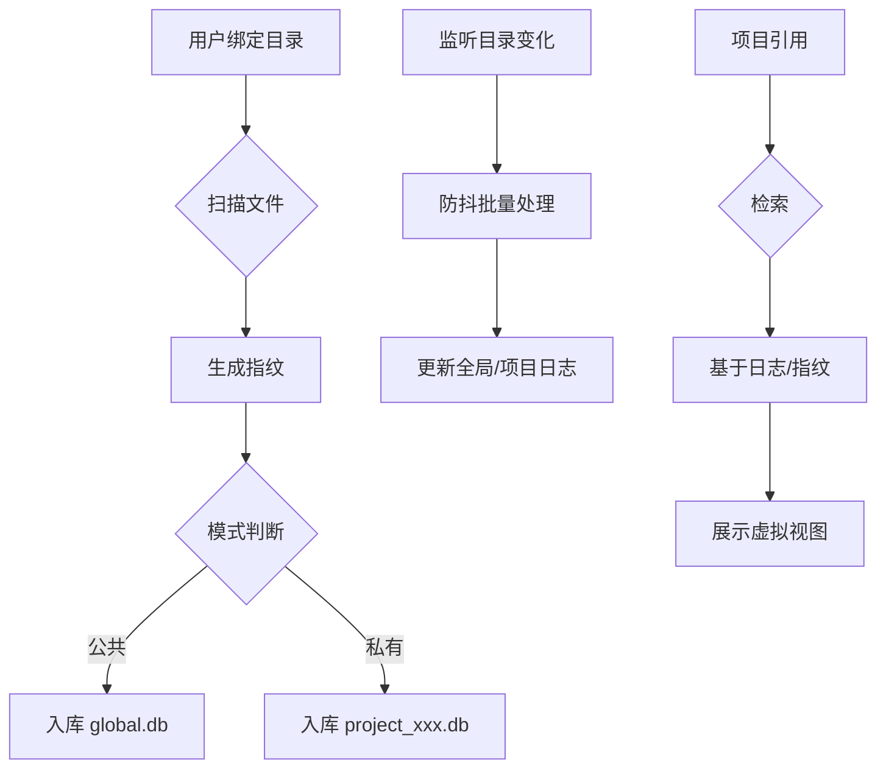

# 智归档 OS (Media Assistant) v2 设计文档

## 1. 核心设计理念

### 1.1 虚拟项目 (Virtual Project)
所有项目本质是「虚拟容器」，只记录文件物理路径，**不移动/管理源文件**。
*   **多源绑定**：一个项目可以绑定多个目录、单个文件，甚至跨盘符/外接存储。
*   **新手友好**：新建文件夹自动生成绑定的虚拟项目。
*   **专业模式**：手动创建虚拟项目，灵活绑定任意资源。

### 1.2 双模式素材管理
*   **全局公共素材池**：用户主动绑定的目录。
    *   **特性**：全局共享、天然去重（基于指纹）、可全库搜索。
    *   **存储**：`global.db`
*   **项目私有素材**：仅当前项目可见。
    *   **特性**：素材不进公共池，复用监听/日志/指纹机制。
    *   **存储**：`project_{id}.db`

### 1.3 文件全生命周期追踪
*   **监听**：只监听用户绑定的目录（不扫全硬盘），采用防抖+批量处理。
*   **血缘/生成链**：记录文件祖宗源文件，追踪复制/修改/派生关系，可回溯原始版本。
*   **日志**：全局日志 + 项目日志。支持操作追溯/恢复。

### 1.4 高效检索与去重
*   **检索**：基于日志/索引，不直接扫硬盘，毫秒级出结果。
*   **去重**：全文件生成唯一指纹（自适应抽样哈希），公共池天然去重。
*   **性能保障**：
    *   **Bloom Filter**: 内存级路径存在校验，避免无效数据库 I/O。
    *   **LRU Cache**: 资产元数据热点缓存，支持 10 万级资产流畅访问。

## 2. 核心数据流转

## 3. 架构设计 (Architecture)

### A. 技术栈
*   **主语言**: Go
*   **UI**: Electron (Vue 3 + Vite)
*   **常驻服务**: Go Core + 系统托盘
*   **文件监听**: fsnotify (防抖 + 批量聚合)
*   **存储**: SQLite (分库设计)

### B. 数据库架构 (Logical Separation in Single DB)
*   **物理存储**: 单个 SQLite 数据库 (`media_assistant.db`)，降低 MVP 工程复杂度。
*   **逻辑隔离**: 通过字段区分作用域。
    *   **Global Scope**: `project_id` 为空，所有项目可见。
    *   **Project Scope**: `project_id` 有值，仅该项目可见。
*   **表结构设计**:
    *   `assets`: 存储所有文件指纹和元数据，增加 `scope` 字段。
    *   `projects`: 存储虚拟项目信息。
    *   `project_assets`: 存储项目与素材的引用关系（Virtual Binding）。
    *   `logs`: 统一日志表，通过 `project_id` 区分全局/项目日志。
*   **未来扩展**: 当单库记录超过 100 万级时，可平滑迁移至物理分库方案。

### C. 关键设计原则
*   **无侵入**: 不移动/修改/加密用户源文件，仅记录路径。
*   **轻量**: 只监听用户指定目录，CPU/IO 占用极低。
*   **可扩展**: 一套底层逻辑适配公共/私有素材，分库无架构改动。
*   **高可靠**: 日志只追加不修改，崩溃可重建索引。

### D. UI Suite 架构 (Electron Multi-Window)
采用 **单体前端项目，多窗口异构运行** 的策略，在同一个 Vue 项目中通过路由区分不同的 UI 形态。

*   **统一前端工程**: 
    *   所有 UI（主窗口、Dock、通知、菜单）共享同一套 Pinia 状态定义、API 客户端、图标库和 CSS 变量。
    *   **路由规划**:
        *   `/`: 管理端主界面 (Main Window)
        *   `/dock`: 悬浮条界面 (Dock Window)
        *   `/notification`: 自定义通知气泡 (Notification Window)
        *   `/menu`: 全局快捷键呼出的自定义菜单 (Context Menu Window)

*   **窗口管理策略**:
    *   **Main Window**: 标准窗口，负责复杂管理操作。
    *   **Dock Window**: 常驻桌面，无边框 (Frameless)，透明背景，置顶。
    *   **Transient Windows (Menu/Notification)**:
        *   **Menu**: 隐藏运行，通过 **全局快捷键** (由 Go Backend 捕获) 触发显示在鼠标位置。
        *   **Notification**: 收到系统事件时创建/显示，短暂展示后自动销毁或隐藏。

*   **交互流程 (Global Hotkey)**:
    1.  **Go Backend**: 注册系统全局快捷键 (e.g., `Alt+Space`)。
    2.  **Signal**: 快捷键触发 -> Go 发送 WebSocket/HTTP 信号给 Electron 主进程。
    3.  **Electron**: 
        *   计算鼠标当前位置。
        *   移动 `/menu` 窗口到该坐标。
        *   执行 `window.show()` 和 `window.focus()`。

## 4. 功能模块
*   **核心功能**：悬浮于桌面，提供素材的“最后一步”快速接入。
*   **展示内容**：
    *   **常用项目/目录**：快捷入口，点击即开。
    *   **横向时间轴**：素材按时间顺序横向排列，支持向右滑动查看更多。
*   **搜索逻辑**：
    *   **局部搜索**：在选中项目/目录时，搜索范围锁定在当前容器。
    *   **全局搜索**：未选中容器时，搜索全库索引。
*   **交互体验**：支持从 Dock 直接拖拽素材至剪映或其他剪辑软件（基于系统绝对路径）。

### E. Dock 栏交互模型 (Dock Interaction Model)
Dock 栏不仅仅是快捷启动器，更是素材流转的**双向枢纽**。

#### 1. 双向拖拽 (Bi-directional Drag & Drop)
*   **拖入 (Drag-In) - 收集**:
    *   **行为**: 用户将文件从外部（资源管理器、网页、微信）拖入 Dock 栏。
    *   **处理**: 
        *   系统立即捕获文件路径。
        *   后台自动触发 `index_file`，将文件纳入库中。
        *   如果拖入到特定“项目抽屉”上，自动建立项目关联。
*   **拖出 (Drag-Out) - 分发**:
    *   **行为**: 用户将 Dock 栏中的文件拖出到外部软件（PR、PS、剪映）。
    *   **处理**:
        *   前端发起原生拖拽事件，携带 `text/uri-list` 数据。
        *   后端确保提供标准化的系统绝对路径 (e.g., `C:\Work\Video.mp4`)。
        *   目标软件识别路径后直接导入素材。

#### 2. 抽屉式浏览 (Drawer Browsing)
*   **概念**: Dock 上的目录图标不是简单的链接，而是“抽屉把手”。
*   **交互**:
    *   点击图标 -> 向上展开半透明抽屉。
    *   抽屉内展示该目录下的最新文件（按时间倒序）。
    *   再次点击或点击外部区域 -> 抽屉收起。

## 4. 插件化与分布式架构 (新)

### A. 基座模式 (Core OS as a Service)
*   **定位**：智归档 OS 作为底层基座，负责资产索引、指纹计算及核心数据库。
*   **内网通信接口**：内置轻量级 API 服务（HTTP/WebSocket），支持插件或外部程序调用。
*   **优势**：保持基座轻量、稳定，避免功能臃肿。

### B. 独立插件系统 (Standalone Executables)
*   **模式**：功能模块（如剪映解析、PR 插件、AI 增强）作为独立的 `.exe` 程序运行。
*   **组网协同**：插件通过局域网/内网与基座通信，支持单机多进程或多机分布式协作。
*   **隔离性**：插件故障不影响基座运行，解决沙箱安全隐患，支持不同开发语言编写插件。

### C. 典型应用场景
*   **剪映助手插件**：独立运行，解析剪映项目后通过 API 回传至基座进行素材标记与归档。
*   **工作室协作**：一台主机作为资产服务器，多台剪辑工作站运行轻量插件接入。

### D. 全局日志与诊断系统 (新)
*   **双轨日志**：
    *   **业务日志**：存入 SQLite，用于在 UI 界面向用户展示软件当前工作状态（如：扫描进度、归档记录）。
    *   **调试日志**：存入本地滚动文件，记录详细的技术栈追踪（Stack Trace），用于故障排查。
*   **用户交互**：
    *   **实时日志面板**：前端展示简洁的工作流日志。
    *   **一键导出诊断包**：支持将数据库日志、文件日志和系统环境信息打包导出。

### E. 内网插件架构与通信协议 (新)
*   **核心设计**：
    *   **基座 OS (Core)**：作为服务端，监听内网端口（默认 32000）。提供素材管理、搜索、文件系统监听等核心能力。
    *   **独立插件 (Plugin EXE)**：作为客户端，独立运行。通过 HTTP/WebSocket 与基座通信。
*   **通信协议规范**：
    *   **协议类型**：RESTful API (控制) + WebSocket (实时事件)。
    *   **服务发现**：基座启动时尝试占用固定端口，若失败则自增。插件启动时扫描本地特定端口范围或通过环境变量获取。
    *   **安全认证**：
        *   **配对码机制**：插件首次连接需用户在基座 UI 确认配对。
        *   **API Token**：配对成功后发放长期有效的加密 Token。
*   **核心 API 定义**：
    *   `GET /api/assets/search`：跨插件素材搜索。
    *   `POST /api/assets/export`：请求基座准备素材供插件导入（如剪映项目文件生成）。
    *   `WS /events`：实时通知插件素材库更新、扫描进度等。
*   **优势**：
    *   **语言解耦**：插件可以用 C#、Python 或 Go 编写，不限于 Go/TS。
    *   **进程隔离**：插件崩溃不会拖累基座，基座升级不强制插件同步。
    *   **安全合规**：不依赖软件内嵌沙箱，直接走系统级进程通信，权限清晰。

## 5. 交互设计 (Interaction Design)

### 5.1 首次运行向导 (Onboarding)
*   **原则**: 主动询问，绝不静默扫描。
*   **欢迎卡片**:
    *   **标题**: "是否将系统常用目录加入素材库？"
    *   **选项**: 下载 (默认勾选), 图片 (默认勾选), 视频 (默认勾选), 音乐, 桌面.
    *   **动作**: [开始索引] / [跳过]
*   **虚拟项目映射**:
    *   `Downloads` -> 虚拟项目 📁 "下载"
    *   `Pictures` -> 虚拟项目 📁 "图片"

### 5.2 智能过滤 (Smart Filtering)
针对系统目录（如下载、桌面），实施严格过滤以防止垃圾文件污染：
*   **排除扩展名**: `.exe`, `.msi`, `.zip`, `.rar`, `.tmp`, `.log`, `.part`, `.iso`, `.dmg`.
*   **排除属性**: 隐藏文件, 系统文件.
*   **排除目录**: 临时目录, 缓存目录 (`.cache`, `node_modules`).

## 6. 开发计划 (Development Plan)

### 后端 (Go)
- [x] 实现自适应抽样指纹算法 (Adaptive Fingerprinting)。
- [x] 实现基于“大小+指纹”的资产身份重连逻辑 (Relinking)。
- [x] 实现 LRU 资产缓存与布隆过滤器优化。
- [x] 集成 dHash 感知哈希算法用于图片分析。
- [ ] 扩展关联表，支持存储项目专属元数据（JSON 格式）。
- [ ] 实现基于 Goroutines 的动态定时扫描调度器。
- [ ] 增加视频元数据提取插件（集成 FFmpeg 抽帧）。
- [x] 实现基于数据库与本地文件的双轨日志系统。

### 前端 (Vue/TS)
- [ ] 编写通用的 `apiClient` 包装器，支持环境切换。
- [ ] 设计“项目同步设置”界面（支持自定义分钟数）。
- [ ] 实现“重复/子孙素材”发现时的交互提示 UI。
- [ ] 优化素材列表页，支持显示项目专属标签。

### 业务逻辑
- [ ] 定义标签继承的具体优先级规则。
- [ ] 设计“素材搬运/拷贝”在软件内的引导流程。
